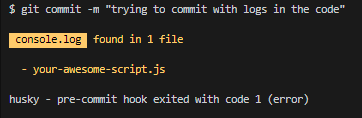
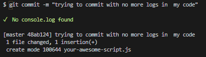

# console-log-checker

The main goal for this package is to be used with git hooks like pre-commit or pre-push to prevent `console.log` debugging to be commited in your code.

We recommend to use this package with husky.

With **console-log-checker**, wether you try to commit changes with `console.log` in your code, you can expect console-log-checker to warn you and abort the commit



If no `console.log` is found in your code, you will be notified about that aswell.



### How to use

#### 1. Install console-log-checker and husky

```
npm install --save-dev husky console-log-checker
```

or

```
yarn add husky console-log-checker --dev
```

#### 2. Active husky hooks:

```
npx husky install
```

or

```
yarn husky install
```

#### 3. Add husky hook for console-log-checker:

```
npx husky add .husky/pre-commit "npx console-log-checker"
```

or

```
yarn husky add .husky/pre-commit "npx console-log-checker"
```

### How to ignore console-log-checker in some file?

You can bypass console-log-checker including the following markation anyware in your file:

`//console-log-checker-ignore`
